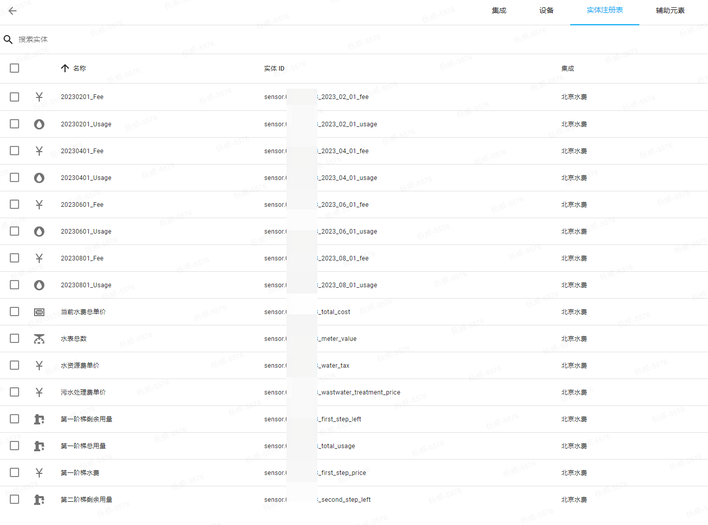
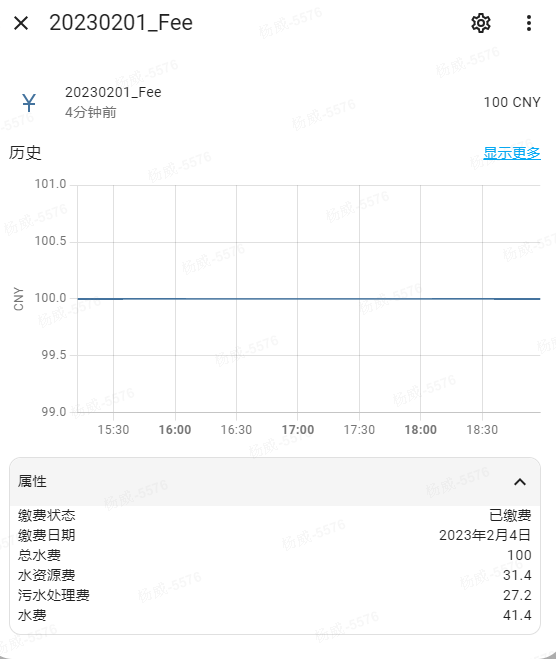
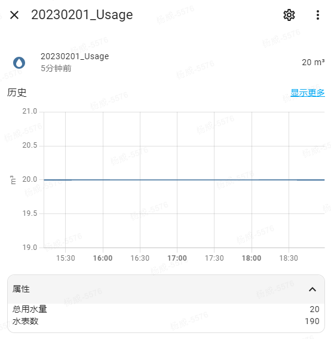

# 北京水费信息Home Assistant集成
# BeiJing Water Meter Statictics

[](https://github.com/hacs/integration)  [](https://github.com/WeiYang1982/bj_water_statictics/releases/tag/v1.0)  [](https://www.gnu.org/licenses/gpl-3.0)


## 功能
 - 通过水表户号获取水费账单及历史用水量(仅限北京市)
 - 支持多个水表户号
 - 全程通过UI配置

## 接入数据
 - 水表总数
 - 单价
   - 水费单价(第一阶梯、第二阶梯)
   - 水资源费单价
   - 污水处理费单价
   - 当前阶梯总单价 即几个单价的总和
 - 使用量
   - 第一阶梯总用量
   - 第一阶梯剩余
   - 第二阶梯剩余
 - 当前年份周期费用
   - 缴费状态
   - 缴费日期
   - 当期总水费
   - 当期水资源费
   - 当前污水处理费
   - 当期水费
 - 当前年份周期使用量
   - 当期总用水量
   - 当期水表数

## 使用方法

### 安装

使用[HACS](https://hacs.xyz/)或[手动下载安装](https://github.com/WeiYang1982/bj_water_statictics/releases)

**注意：本集成需求`Home Assistant`最低版本为`2022.11`**

### 配置
通过UI配置，在集成-北京水费中，输入水表户号即可
<image src="images/config.png">

### 更新数据
固定设置为1天更新一次
```
UPDATE_INTERVAL = timedelta(days=1)
```

### 传感器
 - **水表总数**  sensor.xxx_meter_value
 - **当前水费单价**   sensor.xxx_total_cost
 - **水资源费**   sensor.xxx_water_tax
 - **污水处理费**   sensor.xxx_wastwater_treatment_price
 - **第一阶梯水费**  sensor.xxx_first_step_price
 - **第一阶梯总用量**  sensor.xxx_total_usage
 - **第一阶梯剩余**   sensor.xxx_first_step_left
 - **第二阶梯剩余**  sensor.xxx_second_step_left
 - **历史账单周期费用**   sensor.xxx_2023_02_01_fee
     - 额外属性: 缴费状态、缴费日期、总水费、水资源费、污水处理费、水费
 - **历史账单周期用量**   sensor.xxx_2023_02_01_usage
     - 额外属性: 总用水量、水表数


*sensors列表:*




*历史账单周期费用*




*历史账单周期用量*




## TODO
1. 由于未使用到第二阶梯，顾暂不处理
2. 数据更新频率固定，且未考虑历史数据是否需要更新(不会...)


- - -
自定义集成教程参考：[Building a Home Assistant Custom Component Part 1: Project Structure and Basics](https://aarongodfrey.dev/home%20automation/building_a_home_assistant_custom_component_part_1/)
